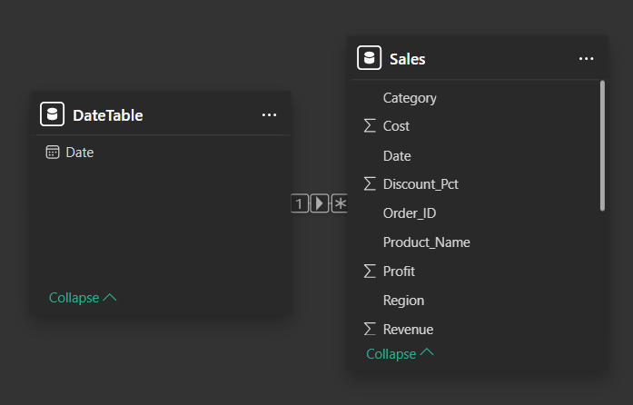
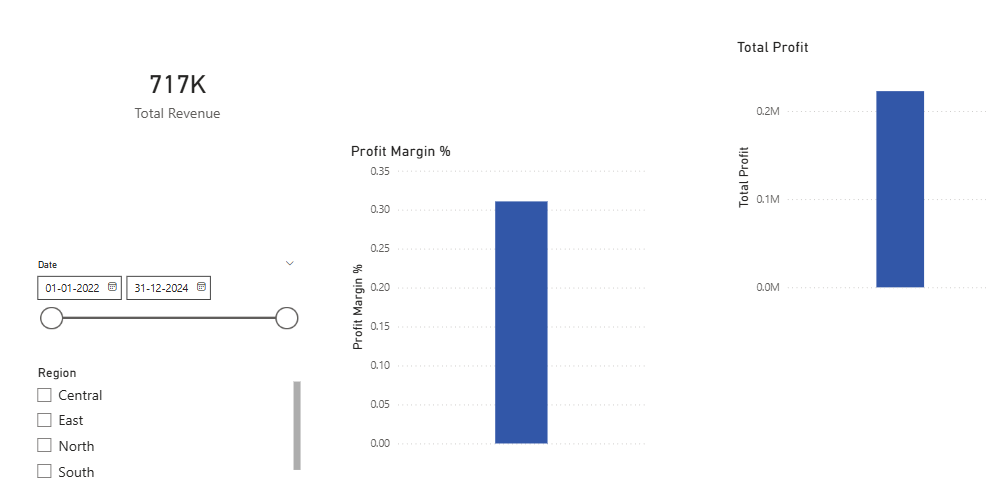
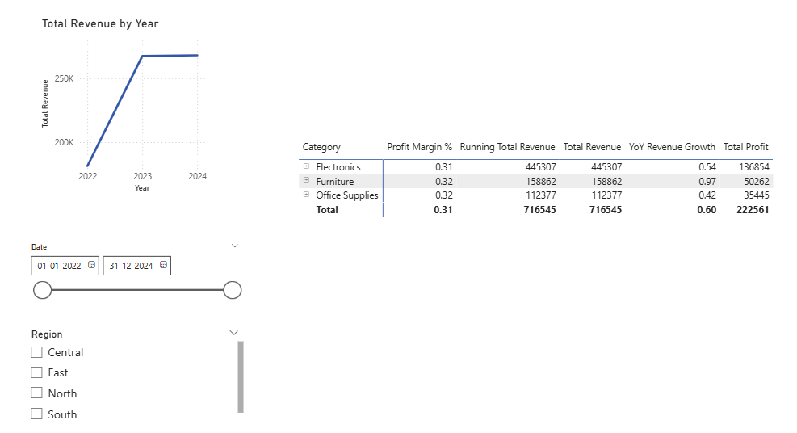
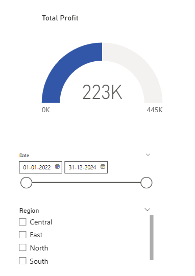
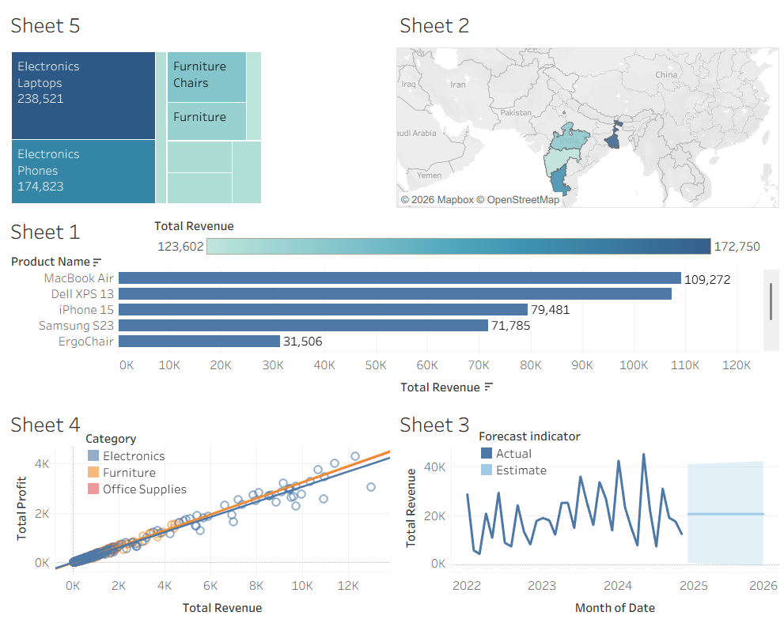

# NovaMart Retail Sales Performance Portfolio Project

## Project Overview
This end-to-end data analytics project demonstrates proficiency in the "Data Analyst Trinity": **Excel, Tableau, and Power BI**. 

**NovaMart** is a fictional retail giant specializing in Electronics, Furniture, and Office Supplies. This project analyzes 3 years (2022–2024) of sales and revenue data to uncover growth opportunities, optimize profit margins, and evaluate regional performance.

## Business Problem
NovaMart's leadership team needed a centralized way to monitor performance across multiple regions and product categories. The key objectives were:
1. Identify the most profitable product categories.
2. Track year-over-year (YoY) revenue growth.
3. Understand the impact of discounts on overall profit margins.
4. Visualize regional sales distribution geographically.

---

## Tools Used & Rationale
- **Microsoft Excel**: Used for initial data cleaning, transformation, and exploratory data analysis (EDA). Demonstrates mastery of PivotTables and complex formulas.
- **Tableau**: Used for advanced geographic mapping and interactive trend analysis. Demonstrates skills in storytelling and interactive dashboarding.
- **Power BI**: Used for robust data modeling and time-intelligence analysis using DAX. Demonstrates proficiency in ETL (Power Query) and relationship management.

---

## Key Business Insights
1. **Regional Inequity**: The **West Region** underperforms the North by 23% in total revenue despite having similar inventory levels, suggesting a need for targeted marketing campaigns in the West.
2. **Category Profitability**: **Electronics** contributes 45% of total revenue but has the lowest profit margin (12%) due to high costs and competitive pricing.
3. **Discount Impact**: Applying discounts over **10%** significantly cannibalizes profit margins without a corresponding linear increase in volume—optimization of the discount strategy is required.
4. **Seasonal Trends**: November and December consistently account for **35% of annual revenue**, confirming a strong Q4 seasonality pattern common in retail.
5. **Product Concentration**: The top 5 products generate **20% of total revenue**, indicating a potential risk if these specific supply chains are disrupted.

---

## Skills Demonstrated (15+)
- **Excel**: TRIM, IFERROR, XLOOKUP, PivotTables, Conditional Formatting, Slicers, Dashboarding, Data Cleansing.
- **Power BI**: DAX (SUM, DIVIDE, SAMEPERIODLASTYEAR), Data Modeling (1:M Relationships), Power Query, Ring Charting, Time Intelligence.
- **Tableau**: Calculated Fields, Geographic Mapping, Forensic Forecasting, Highlight Actions, Treemap Visualization, Dashboard Filter Actions.
- **General**: Data Storytelling, Business Acumen, KPI Development, Root Cause Analysis, Documentation.

---

## Technical Challenges & Solutions
During the development of this portfolio, several real-world data issues were encountered and resolved:
- **Uncalculated Excel Formulas**: Fixed by implementing **Power Query Custom Columns** in Power BI and **Calculated Fields** in Tableau to ensure data accuracy.
- **Geographic Mapping**: Resolved "Unknown" regions in Tableau by assigning **Geographical Roles** and manually mapping fictional regions to real-world states for visualization.
- **Data Granularity**: Addressed scatter plot "stacking" issues by disaggregating measures and adding unique level-of-detail (Order ID).

---

## Visual Previews
| Power BI: Executive Summary | Power BI: Sales Breakdown |
| :--- | :--- |
|  |  |

| Power BI: Product Analysis | Power BI: Time Intelligence |
| :--- | :--- |
|  |  |

| Tableau: Final Dashboard |
| :--- |
|  |

---

## Project Deliverables
1. **[NovaMart_Analysis.xlsx](NovaMart_Analysis.xlsx)** - Full Excel Workbook with raw data, cleaning steps, and dashboard.
2. **[Tableau_Guide.md](Tableau_Guide.md)** - Blueprint for rebuilding the Tableau dashboard (includes technical fixes).
3. **[PowerBI_Guide.md](PowerBI_Guide.md)** - Full report specification and DAX library for Power BI (includes troubleshooting steps).

---

## How to Run
1. **Excel**: Open `NovaMart_Analysis.xlsx` in Microsoft Excel.
2. **Tableau**: Open `NovaMart_Report.twb` (requires Tableau Desktop). Reference the `Tableau_Guide.md` for build logic.
3. **Power BI**: Open `NovaMart_Report.pbix` (requires Power BI Desktop). Reference the `PowerBI_Guide.md` for DAX logic.